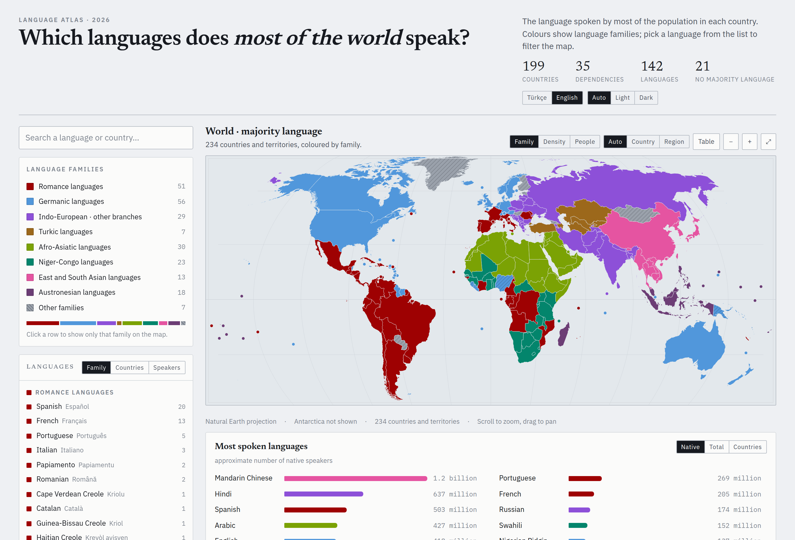

# Dünya Dilleri Atlası

Dünyadaki 234 ülke ve bölgede hangi dilin konuşulduğunu gösteren, dile göre
süzülebilen etkileşimli harita. Tamamen çevrimdışı çalışır: tek dosyalık bir web
sayfası, masaüstü uygulaması (macOS · Windows) ve Android uygulaması olarak
paketlenir. Hiçbir ağ isteği yapmaz, hiçbir izin istemez.

**[▶ Tarayıcıda aç](https://crude0.github.io/World-Languages/)** ·
[📱 Telefon sürümü](https://crude0.github.io/World-Languages/mobile.html) ·
[⬇ İndirilebilir uygulamalar](#i̇ndir)

Arayüz **Türkçe ve İngilizce**; tema **otomatik, açık veya koyu** seçilebilir.



---

## Ne gösteriyor?

| | |
|---|---|
| **234** | ülke ve bağımlı bölge |
| **142** | dil (121'i bir ülkede çoğunluk, 21'i yalnızca bölge düzeyinde) |
| **1.100+** | ülke × dil satırı — her ülkede evde konuşulan dillerin dağılımı |
| **313** | eyalet / il / kanton (12 ülkede) |
| **8,09 milyar** | kapsanan nüfus |

Harita dört soruya cevap verir:

1. **Bu ülkede çoğunluk hangi dili konuşuyor?** Renkler dil ailesini gösterir.
2. **Geri kalanı ne konuşuyor?** Her ülkenin evde konuşulan dil dağılımı, %0,05'e
   kadar inen bir kuyrukla — Belçika'daki Türkçe (%1,3) ya da Almanya'daki
   Ukraynaca (%1,4) gibi topluluklar dâhil.
3. **Bu dil başka nerede konuşuluyor?** Bir dil seçince çoğunluk olduğu ülkeler
   koyu, azınlık olarak konuşulduğu ülkeler soluk renkle işaretlenir. Türkçe
   26 ülkede görünür.
4. **Kaç kişi konuşuyor?** Ülke nüfusu × dil payı ile hesaplanan konuşan sayıları;
   ana dil ve ikinci dil ayrı ayrı.


### Yoğunluk haritası

Bir dil seçiliyken renklendirmeyi **yoğunluğa** (nüfustaki pay) veya **kişi
sayısına** çevirebilirsiniz. İngilizce'de İrlanda ve Birleşik Krallık en koyu
tonda (>%85), ABD ve Avustralya bir kademe açık, Almanya ve İsveç en açık
kademede görünür.


### Eyalet / il düzeyi

12 ülkede harita il, eyalet ya da kanton düzeyine iner: Kanada, ABD, İsviçre,
Belçika, İspanya, Birleşik Krallık, İtalya, Hindistan, Türkiye, Ukrayna,
Finlandiya, Bolivya. Uzaktayken ülke, yaklaşınca bölge görünür (Paradox
oyunlarındaki gibi), ya da elle sabitlenebilir.

Québec'te Fransızca %78 ile British Columbia'da %1,1; Türkiye'nin güneydoğusunda
Kürtçe %82 ile batısında %3; Ukrayna'nın doğusunda Rusça %70 ile batısında %1 —
ülke ortalamasının sakladığı farklar.


### İki dil, üç tema

Arayüz dili Türkçe ve İngilizce arasında geçiş yapar — yalnızca menüler değil,
142 dilin adı, 44 aile etiketi, 352 dağılım satırındaki dil adları, 137 ülke
notu, kıtalar ve sayı biçimi de çevrilir (1,2 milyar ↔ 1.2 billion). Tema
sistemi izler ama elle açık/koyu da seçilebilir; seçim tarayıcıda saklanır.


### Telefon sürümü

Android uygulaması masaüstü sayfasının küçültülmüş hâli değil; telefon için
ayrı yazılmış bir arayüz: tam ekran harita, üstünde yüzen cam katmanlar, alttan
çekilen üç duraklı panel, dokunmatik yüzey jestleri ve sistem yazı tipi.

<p>
  
  
  
</p>

---

## İndir

En güncel sürüm **v0.1.3** — değişiklikler [CHANGELOG.md](CHANGELOG.md) içinde.

| Platform | Dosya | Boyut | Not |
|---|---|---|---|
| Android 7+ | [`Dunya-Dilleri-Atlasi.apk`](dist/Dunya-Dilleri-Atlasi.apk) | 433 KB | İnternet izni yok |
| macOS 10.15+ | [`Dunya-Dilleri-Atlasi.dmg`](dist/Dunya-Dilleri-Atlasi.dmg) | 6,8 MB | Evrensel (Intel + Apple Silicon) |
| Windows 10+ | [`Dunya Dilleri Atlasi.exe`](dist/Dunya%20Dilleri%20Atlasi.exe) | 4,1 MB | Tek dosya, kurulum yok |
| Tarayıcı | [`docs/index.html`](docs/index.html) | 1,1 MB | Tek dosya, çift tıkla aç |

Uygulamalar imzalı değil (Apple/Microsoft geliştirici sertifikası yok):

- **macOS**: ilk açılışta uygulamaya sağ tıklayın → **Aç** → çıkan pencerede yine **Aç**.
  Ya da: `xattr -dr com.apple.quarantine "/Applications/Dunya Dilleri Atlasi.app"`
- **Windows**: SmartScreen uyarısında **Ek bilgi** → **Yine de çalıştır**.
- **Android**: bilinmeyen kaynaklardan kuruluma izin vermeniz gerekir.

Masaüstü uygulamaları işletim sisteminin kendi tarayıcı motorunu kullanır
(macOS'ta WKWebView, Windows'ta WebView2) — kendi pencerelerinde açılırlar,
tarayıcı gerekmez. Motor bulunamazsa kurulu bir tarayıcıyı adres çubuğu olmayan
uygulama kipinde açan bir yedek yol vardır.

---

## Veri

Rakamların nereden geldiği, nasıl hesaplandığı ve nerede zayıf olduğu
**[DATA.md](DATA.md)** dosyasında ayrıntılı yazıyor. Özetle:

- **Sınırlar**: [Natural Earth](https://www.naturalearthdata.com/) 1:50m (ülkeler)
  ve 1:10m (alt bölgeler), kamu malı.
- **Nüfus**: BM Nüfus Bölümü, 2024 tahminleri.
- **Dil payları**: ulusal nüfus sayımlarının dil soruları, Ethnologue ve resmî
  dil politikaları derlenerek yuvarlandı.
- **İkinci dil**: Avrupa'da Eurobarometre 386 (2012) "sohbet edecek düzeyde"
  ölçütü, diğer bölgelerde ulusal tahminler.

Bunlar yaklaşık değerlerdir ve ülkeler arası karşılaştırmalarda dikkat ister:
bir ülkenin sayımı "ana dil", diğerininki "evde konuşulan dil" sorar. Türkiye'de
resmî dil sayımı olmadığı için il rakamları anket temelli tahmindir.

**Şehir düzeyi veri yoktur** — belediye bazında dil istatistiği çoğu ülkede
yayımlanmıyor (örneğin İsveç belediye başına doğum ülkesi verir, konuşulan dili
değil). Uydurmak yerine boş bırakıldı.

---

## Derleme

Gereksinimler: Python 3.9+, Node 18+ (yalnızca doğrulama için), Go 1.21+
(masaüstü), Android SDK build-tools 34 + JDK 17+ (Android).

```bash
make            # veri + web sayfası (tarayıcıda açılabilir tek dosya)
make desktop    # macOS .dmg + .app, Windows .exe
make android    # imzalı APK
make check      # Playwright ile arayüz denetimi
```

Boru hattı:

```
countries-50m.json ──► build_map.py  ──► map_paths.json  ┐
ne_10m_admin_1…    ──► build_subs.py ──► sub_paths.json  ├─► build_data.py ──► data.json
lang_mix / diaspora / population / subdiv ───────────────┘                        │
                                                    page.tmpl.html   ◄────────────┤
                                                    mobile.tmpl.html ◄────────────┘
```

`build_subs.py` ilk çalıştırmada Natural Earth'ün 40 MB'lık alt bölge dosyasını
indirir (depoda tutulmuyor).

### Dosya düzeni

```
build_map.py        ülke sınırları → projeksiyonlu SVG yolları
build_subs.py       eyalet/il sınırları; topoloji koruyan sadeleştirme
build_data.py       tüm katmanları birleştirir, konuşan sayılarını hesaplar
build_page.py       masaüstü sayfası (gömülü fontlarla tek dosya)
build_mobile.py     telefon arayüzü (sistem fontları)
page.tmpl.html      masaüstü arayüzü
mobile.tmpl.html    telefon arayüzü
lang_mix.py         ülke başına dil dağılımı
diaspora.py         göçmen ve azınlık toplulukları (%0,05'e kadar)
population.py       ülke nüfusları
subdiv.py           eyalet/il dil dağılımları ve nüfusları
i18n.py             İngilizce dil adları, aile etiketleri, ülke notları
desktop/            Go başlatıcı + paketleme (WKWebView / WebView2)
android/            WebView kabuğu + APK derleme betiği
tools/              Playwright doğrulama betikleri
```

---

## Teknik notlar

Projede ilginç çıkan birkaç ayrıntı:

- **Projeksiyon** Natural Earth (Šavrič polinomu), Python'da elle uygulandı;
  harita dışa bağımlılığı olmayan düz SVG yolları olarak gömülü.
- **Topoloji koruyan sadeleştirme**: komşu illeri tek tek sadeleştirmek ortak
  sınırda farklı noktalar seçtirip aralarında kılcal boşluk bırakıyordu. TopoJSON'un
  kuralıyla (bir noktanın komşu çifti değişiyorsa orası yay başlangıcıdır) halkalar
  yaylara bölünüp her ortak yay bir kez sadeleştiriliyor.
- **Renk paleti** dil ailelerine göre; renk körlüğü benzetimiyle tüm çiftlerin
  ayırt edilebilirliği doğrulandı, yedinci grup ayrıca taramayla işaretlendi.
- **180. meridyen**: Rusya ve Fiji'nin halkaları kenardan kesilip ayrı parçalara
  bölünüyor, yoksa harita boyunca yatay bir şerit oluşuyor.
- **macOS'ta ISO9660 tuzağı**: DMG içindeki Türkçe karakterli dosya adları
  açılamıyordu (cd9660 sürücüsü Unicode normalizasyonu yapmıyor). Dosya adları
  ASCII, görünen ad ise yerelleştirilmiş `InfoPlist.strings` ile veriliyor.
- **Windows'ta DPI**: uygulama kendini DPI farkında ilan etmezse 2K/4K ekranda
  1080p'de çizilip büyütülüyor ve bulanık görünüyordu.

---

## Lisans

Kod [MIT](LICENSE) ile. Harita sınırları Natural Earth'ten gelir ve kamu malıdır.
Dil ve nüfus verileri kamuya açık kaynaklardan derlenmiştir; kaynak listesi
[DATA.md](DATA.md) içinde.

---

## English summary

An interactive map of the language spoken by the majority in each of 234
countries and territories, filterable by language. Works fully offline as a
single-file web page, a macOS/Windows desktop app, and an Android app — no
network requests, no permissions.

Beyond the majority language it shows the **full home-language breakdown** per
country (down to 0.05%, so diaspora communities are visible), **second-language
knowledge**, **speaker counts**, a **density/heat map** mode, and **state or
province level detail** for 12 countries. Interface language is Turkish.

The interface is available in **Turkish and English** (switchable in the header,
or in the layers menu on mobile), with **automatic, light or dark** themes.

Build with `make`; see [DATA.md](DATA.md) for sources and known limitations.
