**English** · [Türkçe](README.tr.md)

# World Language Atlas

An interactive map of the language spoken by the majority in each of 234
countries and territories, filterable by language. It works entirely offline:
one self-contained web page, a desktop app (macOS · Windows) and an Android app.
No network requests, no permissions.

**[▶ Open in your browser](https://crude0.github.io/World-Languages/)** ·
[📱 Phone version](https://crude0.github.io/World-Languages/mobile.html) ·
[⬇ Downloads](#downloads)

The interface is available in **Turkish and English**; the theme follows the
system or can be set to **light or dark** by hand.

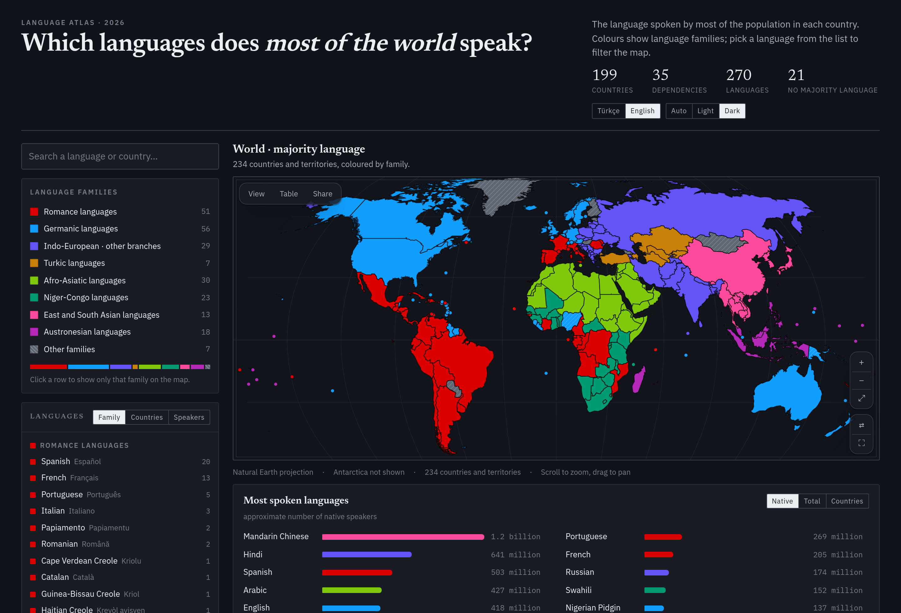

---

## What it shows

| | |
|---|---|
| **234** | countries and dependent territories |
| **270** | languages (121 are a majority somewhere, 136 only at region level, 13 official only) |
| **1,100+** | country × language rows — the home-language breakdown of every country |
| **507** | states / provinces / cantons (in 18 countries) |
| **30** | writing systems, derived from the languages' own names for themselves |
| **8.09 billion** | people covered |
| **7.98 billion** | counted under a named first language |

The map answers four questions:

1. **What does the majority speak here?** Colour shows the language family.
2. **What does everyone else speak?** The full home-language distribution of each
   country, with a tail reaching down to 0.05% — so communities like Turkish in
   Belgium (1.3%) or Ukrainian in Germany (1.4%) are visible.
3. **Where else is this language spoken?** Pick a language and the countries
   where it is the majority turn solid, while the ones where it is a minority
   are tinted. Turkish appears in 26 countries.
4. **How many people speak it?** Speaker counts computed as country population ×
   language share, native and second-language kept apart.

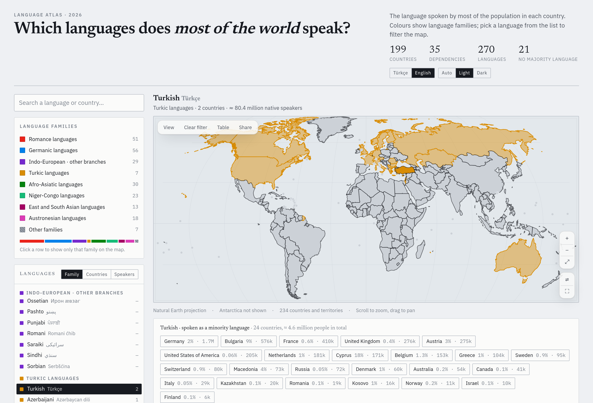

### Density map

With a language selected you can switch the colouring to **density** (share of
the population) or **head count**. For English, Ireland and the UK sit in the
darkest band (>85%), the US and Australia one step lighter, Germany and Sweden
lightest of all.

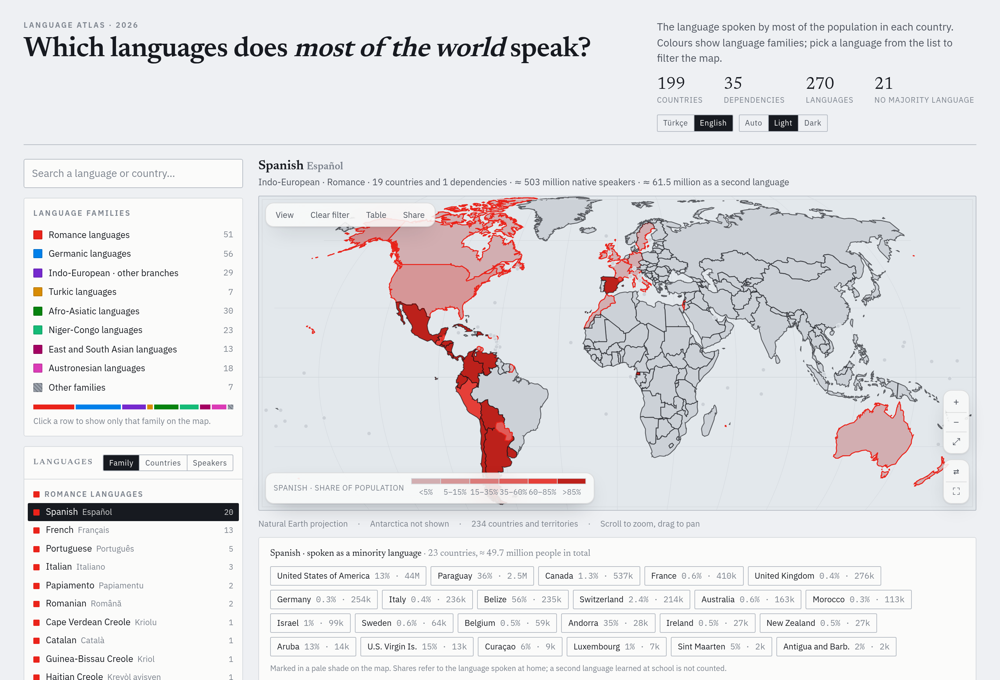

### Two more layers

The **Layer** options in the **View** sheet, floating over the map, ask the
same countries two further questions.

**Script** — which alphabet is the language written in? It says something the
family map does not: Turkish, Vietnamese and Indonesian are unrelated yet all
write in Latin, while Serbian and Croatian are close enough to be mutually
intelligible and are written in Cyrillic and Latin respectively. Latin covers
175 countries, Arabic 25, Cyrillic 10.

The script is not typed in by hand. The letters of each language's own name for
itself are counted by Unicode block, which covers all 155 languages on its own
and leaves no table to maintain — only six exceptions are written out. The 13
languages written in **two** scripts are marked separately: Punjabi in Gurmukhi
in India and Shahmukhi in Pakistan, Kazakh moving to Latin between 2023 and
2031, Kurdish in Latin in Türkiye and in Arabic script in Iraq.

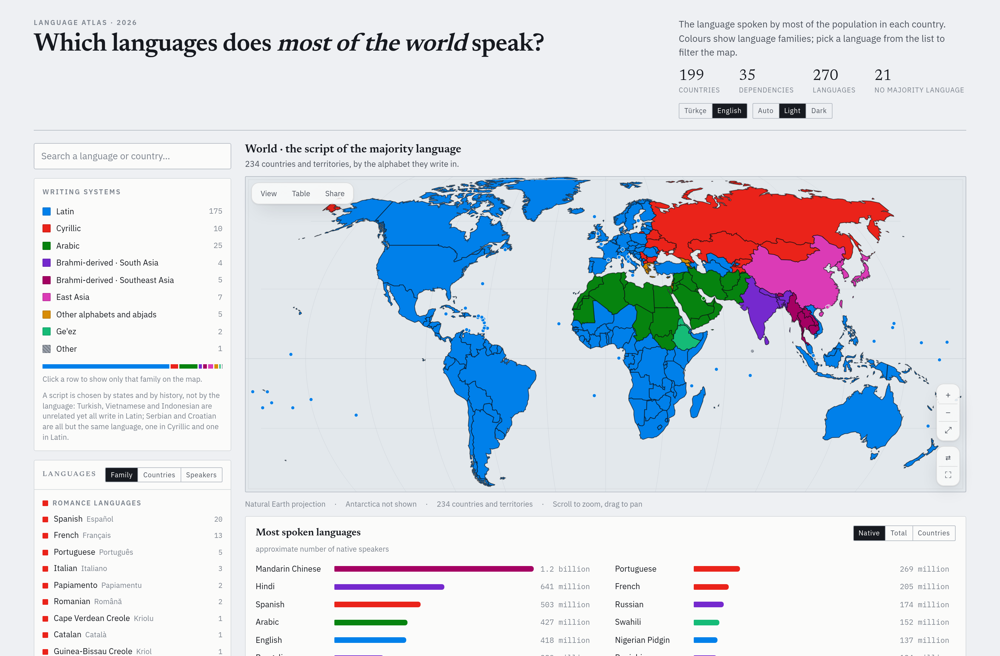

**Official language** — is the language of the state the language of the home?
Across half of Africa it is not. Switching the layer transforms the continent:
west and central Africa turn the red of French, the south and east the blue of
English. English is official in **51** countries but the home language of only
36; French is official in 18 and spoken at home in 13.

The **23 countries whose home language is not on the official list at all** are
cross-hatched: Nigeria (Pidgin at home, English in law), Senegal (Wolof /
French), Sierra Leone (Krio / English), South Sudan (Juba Arabic / English),
Mauritius, Jamaica, the Solomon Islands and others. New Zealand runs the other
way: English was never declared official, and the languages official in law are
Māori (1987) and New Zealand Sign Language (2006).

The table covers all 234 countries and is ordered by **legal precedence**, not
by everyday use — Ireland's constitution names Irish the first official language
while daily life runs in English, and both are listed in that order. The 16
countries that have declared no official language in law are marked as such, and
48 countries carry a note explaining what the layer is showing.

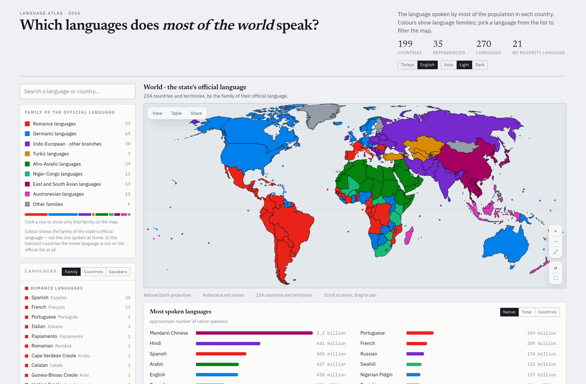

### State and province level

In 18 countries the map descends to province, state or canton level: Russia,
China, the US, Canada, India, Nigeria, South Africa, France, Germany, Spain,
Italy, the UK, Ukraine, Türkiye, Switzerland, Belgium, Finland and Bolivia.
Brazil is deliberately left out: Portuguese is around 98% in all 27 states, so
its geometry would buy a single flat colour. Countries when zoomed out, regions
when you zoom in (the way the recent Paradox games do it), or pinned by hand.

French is 78% in Québec and 1.1% in British Columbia; Kurdish is 82% in
south-eastern Türkiye and 3% in the west; Russian is 70% in eastern Ukraine and
1% in the west — differences a national average hides.

**Russia's 83 federal subjects** are the largest addition. More than 30 languages
are official at republic level there, and the map used to draw the whole country
in one colour. Tatarstan now reads Tatar, Chuvashia Chuvash, Sakha Yakut and Tuva
Tuvan in the Turkic colour, while Chechnya, Ingushetia, Dagestan and
Kabardino-Balkaria stand apart in their own Caucasian languages.

**China's 31 provinces** split "Chinese" into the languages it actually is:
Mandarin, Cantonese, Wu, Min, Hakka, Xiang and Gan are not mutually intelligible.
Shanghai and Zhejiang read Wu, Fujian and Hainan Min, Jiangxi Gan, Hunan Xiang,
Guangdong Cantonese — alongside Uyghur in Xinjiang, Tibetan in Tibet, Mongolian
in Inner Mongolia and Zhuang in Guangxi.

**Nigeria's 37 states** show what a national average cannot: the country has no
majority language, and the real pattern is Hausa in the north, Yoruba in the
south-west, Igbo in the south-east and a Nigerian Pidgin belt across the Niger
Delta. **South Africa's 9 provinces** come from Census 2022, where none of the 12
official languages is a national majority. **France** adds Corsican, Breton and
Occitan plus the overseas creoles, and **Germany's 16 Länder** come from the 2022
census, the first to ask which language a household speaks.

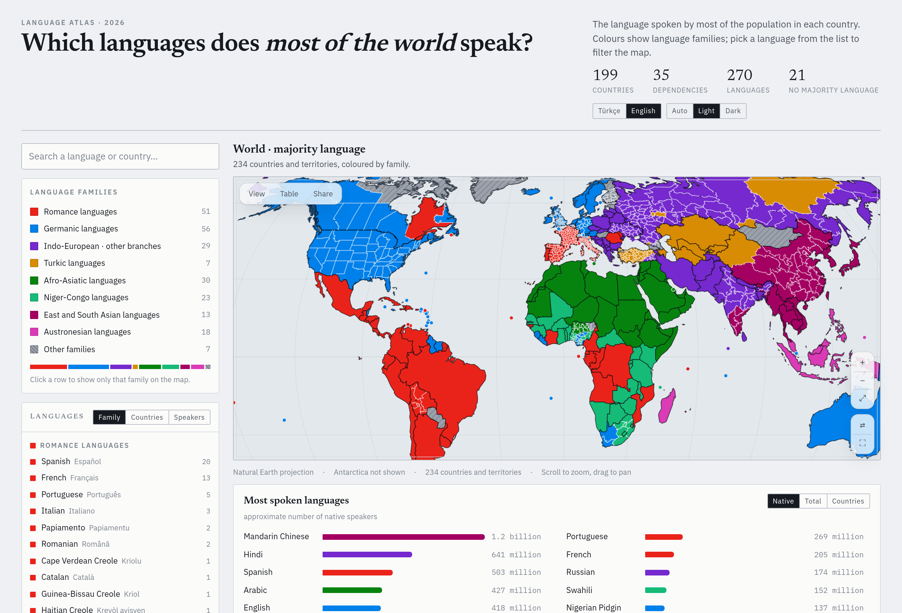

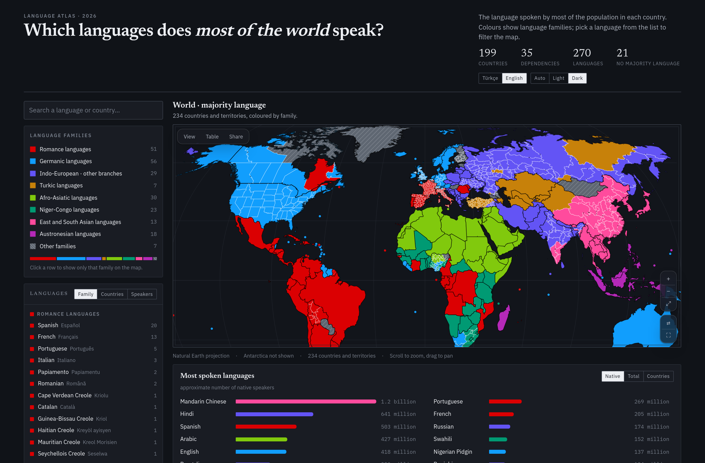

### Compare two places

Pick a country and press **Compare with …**; choose a second place and the card
splits into two columns with both distributions side by side. Underneath,
**spoken in both** lists the languages they share, each at the smaller of the two
shares — a floor on how many people that language reaches in both. Regions work
as well as countries: Tatarstan against Chuvashia, Québec against Ontario.

### The world in the languages you speak

A fourth layer, **I speak**. Tick the languages you know in the list and the map
colours every country by the share of its population that speaks at least one of
them, as a first or second language. Turkish plus English comes to roughly 1.81
billion people. The choice is stored in your browser and travels in the link
(`#k=know&kn=tr.en`), so it can be shared.

The layer reads two ways. **Share** works as above. **Home language** instead
lights only the countries where one of your languages is the *majority language
spoken at home*, each in the colour of its own family, and dims the rest —
Turkish plus English gives 38 countries and about 538 million people. "Where
could I get by" and "where is my language the language" are different questions,
and they get different modes.

In share mode the shares are added and capped at 100%, so people who speak two of
your languages are counted twice — the figure is an upper bound, and the panel
says so.

Hovering a country tells you what share of its population you could talk to, how
many people that is, and the three languages contributing most. The scale runs
red to green; the smallest gap between neighbouring bins is ΔE 9.5 (CIEDE2000),
under all three kinds of colour blindness as well as normal vision.

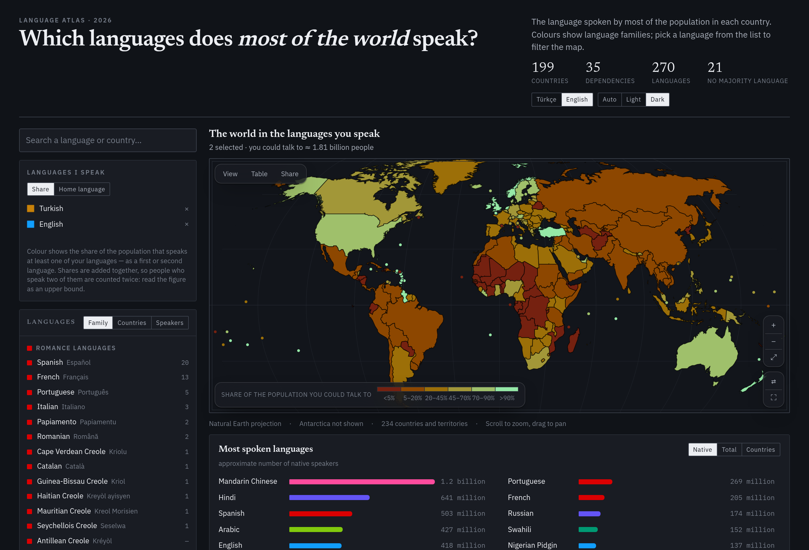

### Download the view

The **PNG** and **SVG** buttons in the **Share** sheet put the current view — zoom, layer, filter,
selection — into a single file. The SVG stands on its own: only the rules that
concern the map are copied out of the page's stylesheet, and culled paths are
never written. The filename is derived from what is on screen
(`dunya-dilleri-off-french.svg`). Both are in the layer menu on the phone.

### Controls and full screen

Map modes do not crowd the title bar: a three-button glass bar floats over the
map — **View**, **Table**, **Share**. Layer, colour and detail live in the View
sheet, grouped, each group with a line saying what it does. The zoom stack sits
in the opposite corner, with buttons to move the panels to the other side (⇄)
and to go full screen (⛶).

**Full screen** hands the whole viewport to the map: page, sidebar and cards go
away, the controls stay because they are already on the map. It uses the
Fullscreen API where available and falls back to a fixed overlay where it is
not. The macOS app has it in the View menu as **Map Only (⇧⌘F)**.

Floating surfaces are frosted glass. Where `backdrop-filter` is unsupported, or
the system asks for reduced transparency, they fall back to a solid panel
colour: legibility comes before the material.

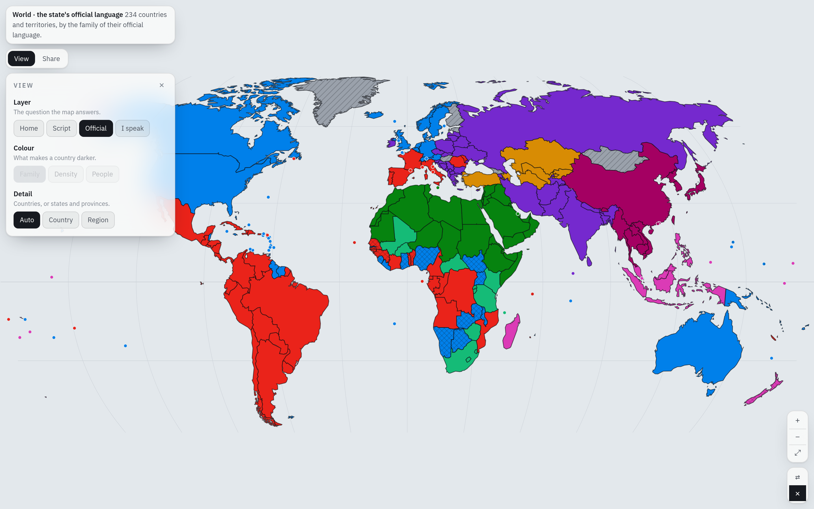

### Colours

Nine legend entries: eight language-family colours plus a neutral "other". The
palette is not hand-picked — the eight hues are searched in OKLCH space and
verified with a colour-vision-deficiency simulation (Machado 2009, protanopia /
deuteranopia / tritanopia) so that **every pair**, not just neighbours, stays
apart, and among the palettes that clear the threshold the search then maximises
saturation. Worst pair: ΔE 9.1 in light mode, 9.0 in dark (normal vision 17.3 /
17.4).

Creole languages do not get a colour of their own: they are drawn in the colour
of their lexifier — the language that gave them their vocabulary — with a
diagonal hatch over it. So Haitian Creole is hatched Romance red and Nigerian
Pidgin is hatched Germanic blue, and the colour carries an extra piece of
information instead of just being a ninth hue.

### Phone version

The Android app is not the desktop page shrunk down; it is a separate interface
written for the phone: full-screen map, floating glass layers above it, a
three-detent bottom sheet, touch gestures and the system typeface.

<p>
  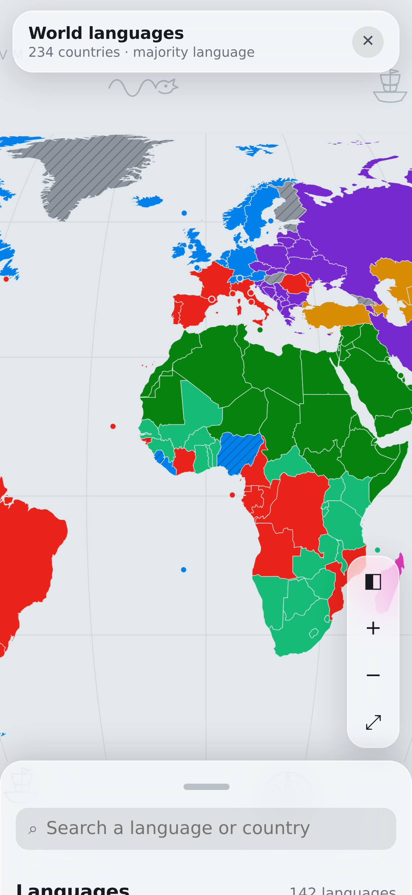
  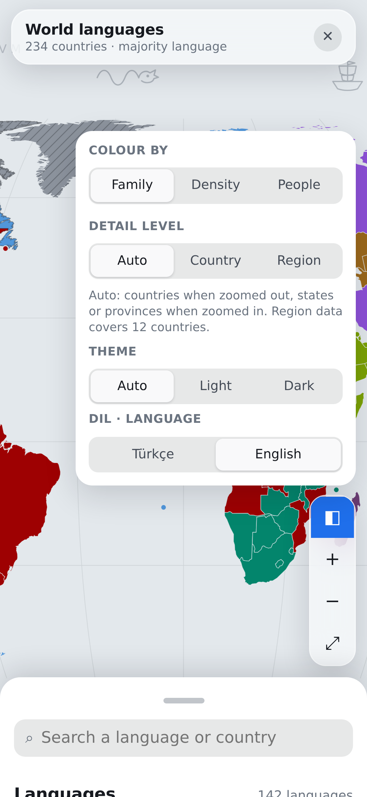
  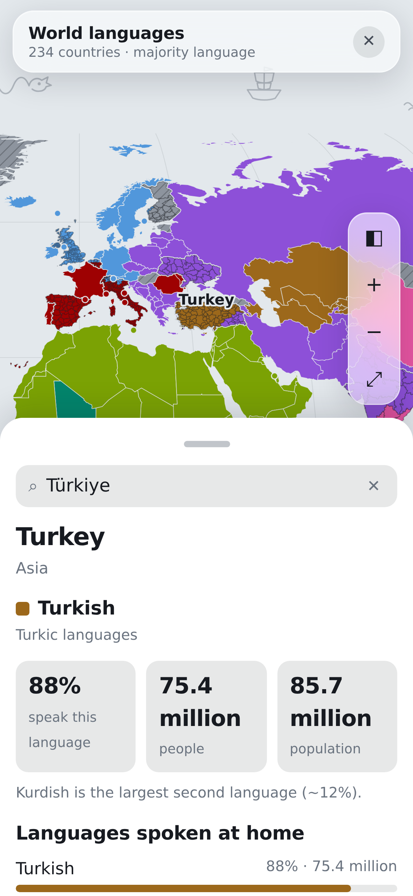
</p>

---

## Downloads

Latest release **v0.9.0** — get it from the
[Releases page](https://github.com/Crude0/World-Languages/releases/latest);
changes are in [CHANGELOG.md](CHANGELOG.md).

| Platform | File | Size | Note |
|---|---|---|---|
| Android 7+ | [`Dunya-Dilleri-Atlasi.apk`](dist/Dunya-Dilleri-Atlasi.apk) | 665 KB | No internet permission |
| macOS 10.15+ | [`Dunya-Dilleri-Atlasi.dmg`](dist/Dunya-Dilleri-Atlasi.dmg) | 8.7 MB | Universal (Intel + Apple Silicon) |
| macOS, no disk image | [`Dunya-Dilleri-Atlasi-mac.zip`](dist/Dunya-Dilleri-Atlasi-mac.zip) | 3.5 MB | Unzip and drag the app across |
| Windows 10+ | [`Dunya Dilleri Atlasi.exe`](dist/Dunya%20Dilleri%20Atlasi.exe) | 4.9 MB | Single file, no installer |
| Browser | [`docs/index.html`](docs/index.html) | 1.9 MB | One file, just open it |

The browser version is **installable**: open it in Chrome or Safari and pick
"Install" / "Add to Home Screen" and it runs like an app, offline, with no
address bar. Any view you build — a language, a country, a zoom level — has its
own link: press **Link** and share it.

The apps are unsigned (there is no Apple/Microsoft developer certificate):

- **macOS**: on first launch right-click the app → **Open** → **Open** again in
  the dialog. Or: `xattr -dr com.apple.quarantine "/Applications/Dunya Dilleri Atlasi.app"`
- **Windows**: on the SmartScreen warning pick **More info** → **Run anyway**.
- **Android**: you need to allow installation from unknown sources.

The desktop apps use the operating system's own browser engine (WKWebView on
macOS, WebView2 on Windows) — they open in their own window, no browser needed.
If the engine is missing there is a fallback that opens an installed browser in
app mode, without an address bar.

---

## Data

Where the numbers come from, how they are computed and where they are weak is
written out in **[DATA.md](DATA.en.md)**. In short:

- **Borders**: [Natural Earth](https://www.naturalearthdata.com/) 1:50m
  (countries) and 1:10m (subdivisions), public domain.
- **Population**: UN Population Division, 2024 estimates.
- **Language shares**: compiled from the language questions of national
  censuses, Ethnologue and official language policy, then rounded.
- **Second language**: Eurobarometer 386 (2012) "able to hold a conversation"
  in Europe, national estimates elsewhere.

These are approximations and need care in cross-country comparison: one census
asks for "mother tongue", another for "language spoken at home". Türkiye has no
official language census, so its provincial figures are survey-based estimates.

**There is no city-level data** — most countries do not publish language
statistics per municipality (Sweden, for instance, publishes country of birth
per municipality, not language spoken). Rather than invent it, it was left out.

---

## Build

Requirements: Python 3.9+, Node 18+ (verification only), Go 1.21+ (desktop),
Android SDK build-tools 34 + JDK 17+ (Android).

```bash
make            # data + web page (single file, opens in a browser)
make desktop    # macOS .dmg + .app, Windows .exe
make android    # signed APK
make check      # interface checks with Playwright
```

Pipeline:

```
countries-50m.json ──► build_map.py  ──► map_paths.json  ┐
ne_10m_admin_1…    ──► build_subs.py ──► sub_paths.json  ├─► build_data.py ──► data.json
lang_mix / diaspora / population / subdiv ───────────────┘                        │
                                                    page.tmpl.html   ◄────────────┤
                                                    mobile.tmpl.html ◄────────────┘
```

On its first run `build_subs.py` downloads Natural Earth's 40 MB subdivision
file (not kept in the repository).

### Layout

```
build_map.py        country borders → projected SVG paths
build_subs.py       state/province borders; topology-preserving simplification
build_data.py       joins every layer, computes speaker counts
build_page.py       desktop page (single file, fonts embedded)
build_mobile.py     phone interface (system fonts)
pwa.py              manifest, service worker and icon wiring for docs/
anchor.py           label anchors (pole of inaccessibility)
VERSION             single source for the version in every package
page.tmpl.html      desktop interface
mobile.tmpl.html    phone interface
layers.py           writing systems and official languages (the two extra layers)
lang_mix.py         language distribution per country
diaspora.py         migrant and minority communities (down to 0.05%)
population.py       country populations
subdiv.py           state/province distributions and populations
i18n.py             English language names, family labels, country notes
desktop/            Go launcher + packaging (WKWebView / WebView2)
android/            WebView shell + APK build script
tools/              Playwright verification scripts
```

---

## Technical notes

A few details that turned out to be interesting:

- **Projection** is Natural Earth (Šavrič's polynomial), implemented by hand in
  Python; the map is embedded as plain SVG paths with no runtime dependency.
- **Topology-preserving simplification**: simplifying neighbouring provinces one
  by one picked different points along the shared border and left hairline gaps
  between them. Using TopoJSON's rule — a point starts an arc when its pair of
  neighbours changes — rings are split into arcs and each shared arc is
  simplified exactly once.
- **Label anchors** are the pole of inaccessibility of the largest ring, not a
  centroid. A vertex mean lands offshore on concave coasts: Norway's label ended
  up in the sea, Croatia's on top of Bosnia. 228 of 234 anchors are now strictly
  inside their country; the six that are not are pixel-sized (Vatican, Monaco,
  Macao…) and are drawn as pins anyway.
- **The palette is computed, not chosen.** Simulated annealing over OKLCH with a
  colour-blindness model, then checked against the all-pairs threshold. Ten
  colours could not clear it in dark mode's narrow lightness band — which is why
  creoles carry texture instead of a colour of their own.
- **The stutter while panning was strokes, not fills.** It was chased by guesswork
  for a long time; in the end Chrome's own trace records were used to measure
  rasterisation time. 70–80% of it goes into stroking: fills, hatch patterns and
  ornaments cost nothing measurable. Three things followed — country outlines are
  drawn from a coarser geometry when zoomed out (computed in the browser at
  startup, so it adds no bytes to the file), antialiasing is switched off while
  a gesture is in progress, and in region mode the same line is no longer stroked
  several times over. Rasterisation halved in the world view.
- **The 180th meridian**: Russia's and Fiji's rings are cut at the edge and split
  into separate pieces, otherwise a horizontal band is drawn across the map.
- **The ISO 9660 trap on macOS**: files with Turkish characters inside the DMG
  could not be opened (the cd9660 driver does not normalise Unicode). File names
  are ASCII on disk, with the visible name supplied by a localized
  `InfoPlist.strings`.
- **DPI on Windows**: an application that does not declare itself DPI-aware is
  drawn at 1080p and stretched on a 2K/4K display, which looks blurry.

---

## Licence

The code is [MIT](LICENSE). Map borders come from Natural Earth and are public
domain. Language and population data are compiled from public sources; the list
is in [DATA.en.md](DATA.en.md).
