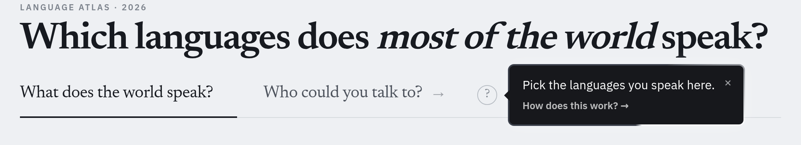
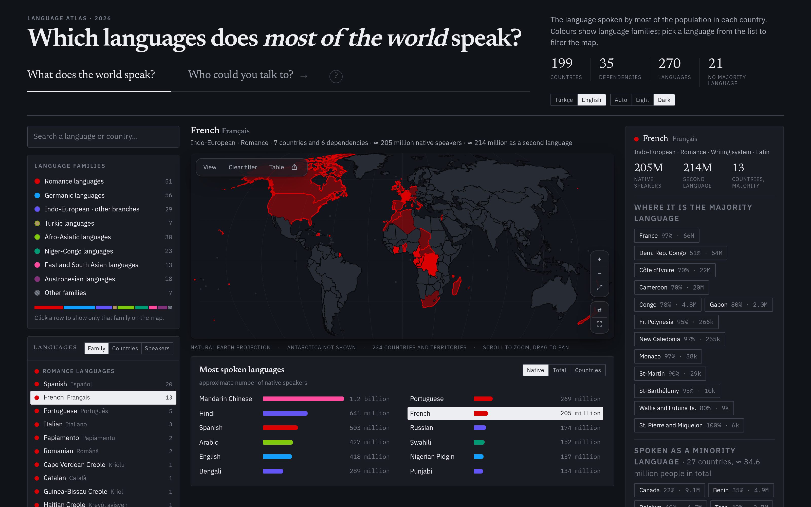
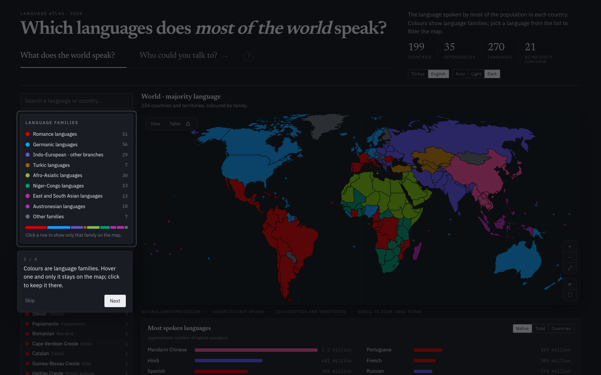
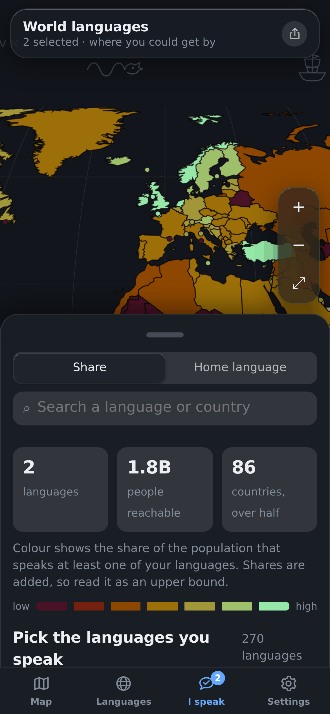

**Türkçe** · [English](README.md)

# Dünya Dilleri Atlası

Dünyadaki 234 ülke ve bölgede hangi dilin konuşulduğunu gösteren, dile göre
süzülebilen etkileşimli harita. Tamamen çevrimdışı çalışır: tek dosyalık bir web
sayfası, masaüstü uygulaması (macOS · Windows) ve Android uygulaması olarak
paketlenir. Hiçbir ağ isteği yapmaz, hiçbir izin istemez.

<p>
  <a href="https://crude0.github.io/World-Languages/"><picture>
    <source media="(prefers-color-scheme: dark)" srcset="docs/img/btn-open-tr-dark.svg">
    
  </picture></a>
  <a href="https://crude0.github.io/World-Languages/mobile.html"><picture>
    <source media="(prefers-color-scheme: dark)" srcset="docs/img/btn-phone-tr-dark.svg">
    
  </picture></a>
  <a href="#i̇ndir"><picture>
    <source media="(prefers-color-scheme: dark)" srcset="docs/img/btn-dl-tr-dark.svg">
    
  </picture></a>
</p>


Arayüz Türkçe ve İngilizce; tema otomatik, açık veya koyu.

| | | | |
|---|---|---|---|
| **234** ülke ve bölge | **270** dil, **121**'i bir yerde çoğunluk | **1.128** ülke × dil satırı | **507** eyalet, il ve kanton |
| **32** yazı sistemi | **8,09 milyar** kapsanan nüfus | **7,97 milyar** adlandırılmış ana dille | **18** ülke bölge düzeyinde |

---

## Ne yapıyor?

<table>
<tr>
<td colspan="2"></td>
</tr>
<tr>
<td colspan="2"><b>Atlas iki soru soruyor</b> ve hangisini seçersen bütün sayfa
ona göre değişiyor. "Dünya ne konuşuyor?" herkesin haritası, "Sen kimlerle
konuşabilirsin?" senin haritan. Soru işareti kısa tanıtımı açıyor.</td>
</tr>
<tr>
<td width="50%"></td>
<td width="50%"></td>
</tr>
<tr>
<td><b>Bir dil seç, nerede yaşadığını gör.</b> Çoğunluk olduğu ülkeler koyu,
azınlık olduğu ülkeler soluk. Kuyruk %0,05'e kadar iniyor, yani Belçika'daki
Türkçe (%1,3) ve Almanya'daki Ukraynaca (%1,4) haritada. Türkçe 26 ülkede
görünüyor.</td>
<td><b>Ya da yoğunluğa göre boya.</b> Nüfustaki pay veya kişi sayısı. Konuşan
sayıları ülke nüfusu × dil payı; ana dil ile ikinci dil ayrı tutuluyor.</td>
</tr>
<tr>
<td></td>
<td></td>
</tr>
<tr>
<td><b>Yazı katmanı.</b> Türkçe, Vietnamca ve Endonezce akraba değil ama üçü de
Latin yazıyor; Sırpça ile Hırvatça anlaşılabilecek kadar yakın, biri Kiril
diğeri Latin. Yazı elle girilmiyor: her dilin kendi adındaki harfler Unicode
bloklarına göre sayılıyor.</td>
<td><b>Resmî dil katmanı.</b> Afrika'nın yarısı renk değiştiriyor: devletin
dili evin dili değil. İngilizce 51 ülkede resmî ama 36'sında evde konuşuluyor.
Evin dili hiçbir resmî listede olmayan <b>23 ülke</b> taralı.</td>
</tr>
<tr>
<td></td>
<td></td>
</tr>
<tr>
<td><b>Yakınlaşınca ülkeler bölgelere ayrılıyor.</b> Fransızca Québec'te %78,
British Columbia'da %1,1; Kürtçe Türkiye'nin güneydoğusunda %82, batısında %3 —
ülke ortalamasının sakladığı farklar.</td>
<td><b>Rusya'nın 83 federal öznesi</b> bunların en büyüğü. Tataristan Tatarca,
Çuvaşistan Çuvaşça, Saha Yakutça okuyor; Çeçenistan, İnguşetya ve Dağıstan
kendi Kafkas dilleriyle ayrı duruyor.</td>
</tr>
<tr>
<td></td>
<td></td>
</tr>
<tr>
<td><b>"Sen kimlerle konuşabilirsin?"</b> Bildiğin dilleri işaretle, her ülke
nüfusunun anlaşabileceğin oranına göre boyansın. Türkçe artı İngilizce yaklaşık
1,81 milyar kişi. Seçim bağlantıda taşınıyor.</td>
<td><b>Bir dile tıkla, kartı açılsın.</b> Ailesi ve yazısı, ana dili ve ikinci
dil olarak konuşan sayısı, çoğunluk olduğu yerler ve azınlık olarak konuşulduğu
her ülke.</td>
</tr>
<tr>
<td></td>
<td></td>
</tr>
<tr>
<td><b>Tam ekran</b> bütün pencereyi haritaya veriyor; gösterge alttaki banda
iniyor. İki yeri yan yana karşılaştırabilir, o anki görünümü <b>PNG ya da
SVG</b> olarak indirebilirsin.</td>
<td><b>Kısa bir tanıtım</b> sayfayı karartıp sırayla tek bir yeri aydınlatıyor.
İkinci sorunun yanındaki soru işaretinin arkasında duruyor ve her güncellemeden
sonra bir kez kendiliğinden geliyor.</td>
</tr>
</table>

### Telefon sürümü

Android uygulaması masaüstü sayfasının küçültülmüşü değil; telefon için yazılmış
ayrı bir arayüz: tam ekran harita, üstünde yüzen cam katmanlar, üç duraklı alt
yaprak, dokunma hareketleri ve sistemin kendi yazı tipi.

<p>
  
  
  
  
</p>

---

## İndir

Güncel derleme
**[Releases sayfasında](https://github.com/Crude0/World-Languages/releases/latest)**;
neyin değiştiği [CHANGELOG.md](CHANGELOG.md) dosyasında.

| Platform | Dosya | Boyut | Not |
|---|---|---|---|
| Android 7+ | [`Dunya-Dilleri-Atlasi.apk`](dist/Dunya-Dilleri-Atlasi.apk) | 690 KB | İnternet izni yok |
| macOS 10.15+ | [`Dunya-Dilleri-Atlasi.dmg`](dist/Dunya-Dilleri-Atlasi.dmg) | 9,3 MB | Universal (Intel + Apple Silicon) |
| macOS, disk imajsız | [`Dunya-Dilleri-Atlasi-mac.zip`](dist/Dunya-Dilleri-Atlasi-mac.zip) | 3,5 MB | Açıp uygulamayı sürükleyin |
| Windows 10+ | [`Dunya Dilleri Atlasi.exe`](dist/Dunya%20Dilleri%20Atlasi.exe) | 5,0 MB | Tek dosya, kurulum yok |
| Tarayıcı | [`docs/index.html`](docs/index.html) | 1,9 MB | Tek dosya, açmanız yeterli |

Tarayıcı sürümü **kurulabilir** — Chrome'da "Yükle", Safari'de "Ana Ekrana
Ekle" — ve sonrasında çevrimdışı, uygulama gibi çalışır. Kurduğunuz her
görünümün kendi bağlantısı var: **Bağlantı**'ya basıp paylaşabilirsiniz.

<details>
<summary>Uygulamalar imzasız — yine de nasıl açılır</summary>

Bu derlemelerin arkasında Apple ya da Microsoft geliştirici sertifikası yok:

- **macOS**: ilk açılışta uygulamaya sağ tıklayıp **Aç** → çıkan uyarıda yine
  **Aç**. Ya da: `xattr -dr com.apple.quarantine "/Applications/Dunya Dilleri Atlasi.app"`
- **Windows**: SmartScreen uyarısında **Daha fazla bilgi** → **Yine de çalıştır**.
- **Android**: bilinmeyen kaynaklardan kuruluma izin vermeniz gerekir.

Masaüstü uygulamaları işletim sisteminin kendi tarayıcı motorunu kullanıyor
(macOS'te WKWebView, Windows'ta WebView2) — kendi penceresinde açılıyor, ayrıca
tarayıcı gerekmiyor. Motor yoksa kurulu bir tarayıcıyı adres çubuğu olmadan
uygulama kipinde açan bir yedek yol var.
</details>

---

## Veri

Sayıların nereden geldiği, nasıl hesaplandığı ve nerede zayıf olduğu
**[DATA.md](DATA.md)** dosyasında yazılı. Sınırlar
[Natural Earth](https://www.naturalearthdata.com/) (kamu malı), nüfus BM Nüfus
Bölümü'nün 2024 tahminleri, dil payları ise ulusal sayımlar, Ethnologue ve
resmî dil politikalarından derlendi.

Bunlar yaklaşık değerler ve ülkeler arası karşılaştırmada dikkat ister: bir
sayım "ana dil" sorar, öteki "evde konuşulan dil". Türkiye'de resmî bir dil
sayımı yok, il rakamları anket temelli tahmin. **Şehir düzeyinde veri yok** —
çoğu ülke belediye başına dil istatistiği yayımlamıyor ve uydurmak seçenek
değildi.

<details>
<summary>Derleme</summary>

Gereksinimler: Python 3.9+, Node 18+ (yalnız doğrulama), Go 1.21+ (masaüstü),
Android SDK build-tools 34 + JDK 17+ (Android).

```bash
make            # veri + web sayfası (tek dosya, tarayıcıda açılır)
make desktop    # macOS .dmg + .app, Windows .exe
make android    # imzalı APK
make check      # Playwright ile arayüz denetimi
```

İş akışı:

```
countries-50m.json ──► build_map.py  ──► map_paths.json  ┐
ne_10m_admin_1…    ──► build_subs.py ──► sub_paths.json  ├─► build_data.py ──► data.json
lang_mix / diaspora / population / subdiv ───────────────┘                        │
                                                    page.tmpl.html   ◄────────────┤
                                                    mobile.tmpl.html ◄────────────┘
```

`src/build_subs.py` ilk çalışmasında Natural Earth'ün 40 MB'lık alt bölge
dosyasını indiriyor (depoda tutulmuyor).

```
src/                bütün derleme betikleri, veri tabloları ve şablonlar
  build_map.py      ülke sınırları → izdüşümlü SVG yolları
  build_subs.py     eyalet/il sınırları; topolojiyi koruyan sadeleştirme
  build_data.py     bütün katmanları birleştirir, konuşan sayılarını hesaplar
  build_page.py     masaüstü sayfası (tek dosya, yazı tipleri gömülü)
  build_mobile.py   telefon arayüzü (sistem yazı tipleri)
  pwa.py            docs/ için manifest, hizmet çalışanı ve simgeler
  anchor.py         etiket çıpaları (erişilmezlik kutbu)
  page.tmpl.html    masaüstü arayüzü
  mobile.tmpl.html  telefon arayüzü
  layers.py         yazı sistemleri ve resmî diller
  lang_mix.py       ülke başına dil dağılımı
  diaspora.py       göçmen ve azınlık toplulukları (%0,05'e kadar)
  population.py     ülke nüfusları
  subdiv.py         eyalet/il dağılımları ve nüfusları
  i18n.py           İngilizce dil adları, aile etiketleri, ülke notları
VERSION             her pakete giren sürümün tek kaynağı
desktop/            Go başlatıcı + paketleme (WKWebView / WebView2)
android/            WebView kabuğu + APK derleme betiği
tools/              Playwright denetimleri, README kareleri ve düğmeleri
```

`node tools/shots.mjs` bu dosyadaki bütün ekran görüntülerini, `python3
tools/make_buttons.py` ise üstteki düğmeleri yeniden üretiyor.
</details>

<details>
<summary>Teknik notlar</summary>

- **İzdüşüm** Natural Earth (Šavrič'in polinomu), Python'da elle yazıldı; harita
  düz SVG yolları olarak gömülü, çalışma zamanında hiçbir bağımlılığı yok.
- **Topolojiyi koruyan sadeleştirme**: komşu illeri tek tek sadeleştirmek ortak
  sınır üzerinde farklı noktalar seçiyor ve aralarında kılcal boşluklar
  bırakıyordu. TopoJSON'un kuralıyla — bir noktanın komşu çifti değiştiğinde yeni
  bir yay başlar — halkalar yaylara bölünüyor ve paylaşılan her yay tam olarak
  bir kez sadeleştiriliyor.
- **Etiket çıpaları** en büyük halkanın erişilmezlik kutbu, ağırlık merkezi
  değil. Köşe ortalaması içbükey kıyılarda denize düşüyor: Norveç'in etiketi
  denizde, Hırvatistan'ınki Bosna'nın üstünde kalıyordu. 234 çıpanın 228'i artık
  kesinlikle ülkesinin içinde; kalan altısı piksel boyutunda (Vatikan, Monako,
  Makao…) ve zaten iğneyle çiziliyor.
- **Palet seçilmedi, hesaplandı.** OKLCH uzayında benzetimli tavlama ve renk
  körlüğü modeli (Machado 2009); yalnız komşular değil, dokuz gösterge renginin
  *her ikilisi* ayrı kalacak biçimde denetlendi. En kötü ikili: açık temada
  ΔE 9,1, koyuda 9,0. Koyu temanın dar açıklık bandında on renk eşiği
  geçemiyordu — kreoller bu yüzden kendi rengi yerine, sözcük dağarcığını aldığı
  dilin renginin üstüne çapraz tarama alıyor.
- **Kaydırmadaki kasmanın sebebi dolgular değil konturlardı.** Uzun süre tahminle
  kovalandı; sonunda Chrome'un kendi iz kayıtlarıyla rasterizasyon süresi
  ölçüldü. Sürenin %70–80'i konturlara gidiyor; dolgular, tarama desenleri ve
  süslemeler ölçülebilir bir maliyet çıkarmıyor. Üç şey buradan çıktı: uzaktayken
  ülke sınırları daha kaba bir geometriden çiziliyor (tarayıcıda açılışta
  hesaplanıyor, dosyaya bayt eklemiyor), hareket sürerken kenar yumuşatma
  kapanıyor ve bölge kipinde aynı çizgi birkaç kez konturlanmıyor. Dünya
  görünümünde rasterizasyon yarıya indi.
- **180. meridyen**: Rusya'nın ve Fiji'nin halkaları kenarda kesilip ayrı
  parçalara bölünüyor, yoksa haritanın ortasından yatay bir bant geçiyor.
- **macOS'te ISO 9660 tuzağı**: DMG içindeki Türkçe karakterli dosyalar
  açılamıyordu (cd9660 sürücüsü Unicode'u normalleştirmiyor). Dosya adları diskte
  ASCII, görünen ad yerelleştirilmiş `InfoPlist.strings` dosyasından geliyor.
- **Windows'ta DPI**: kendini DPI farkındalı ilan etmeyen uygulama 1080p çizilip
  2K/4K ekranda geriliyor ve bulanık görünüyor.
</details>

---

Kod [MIT](LICENSE) lisanslı. Harita sınırları Natural Earth'ten, kamu malı. Dil
ve nüfus verileri açık kaynaklardan derlendi; listesi [DATA.md](DATA.md)
dosyasında.
